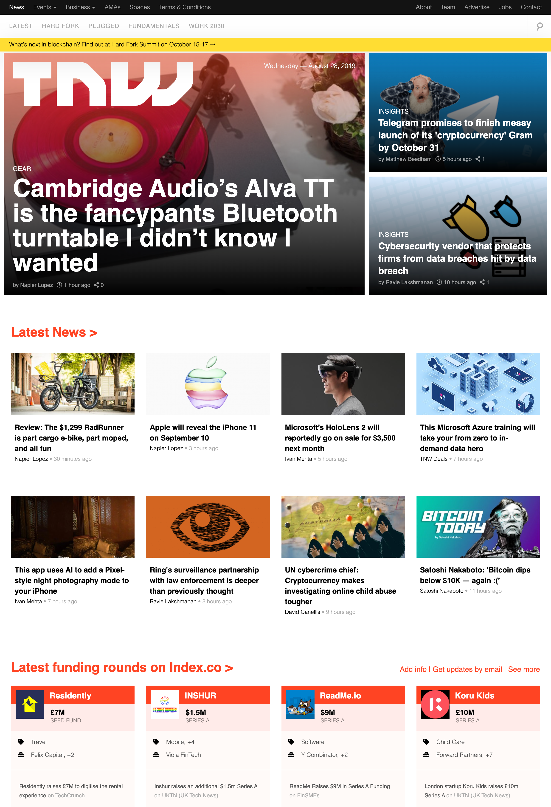
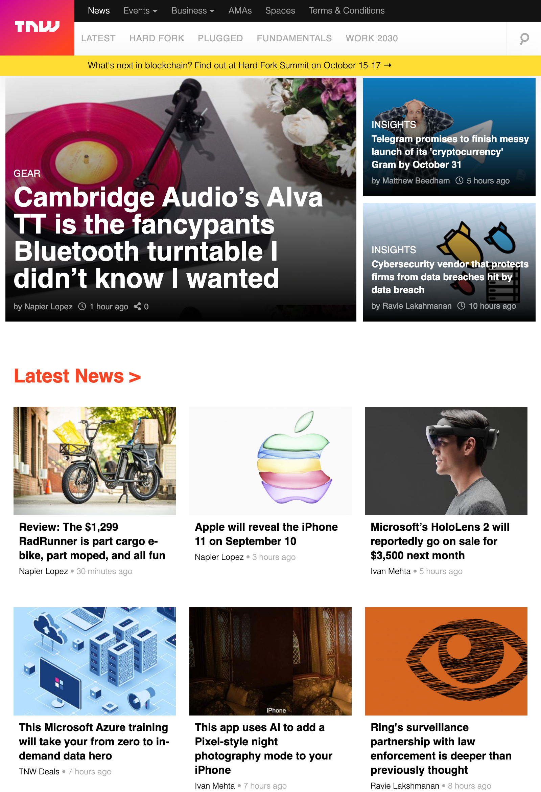
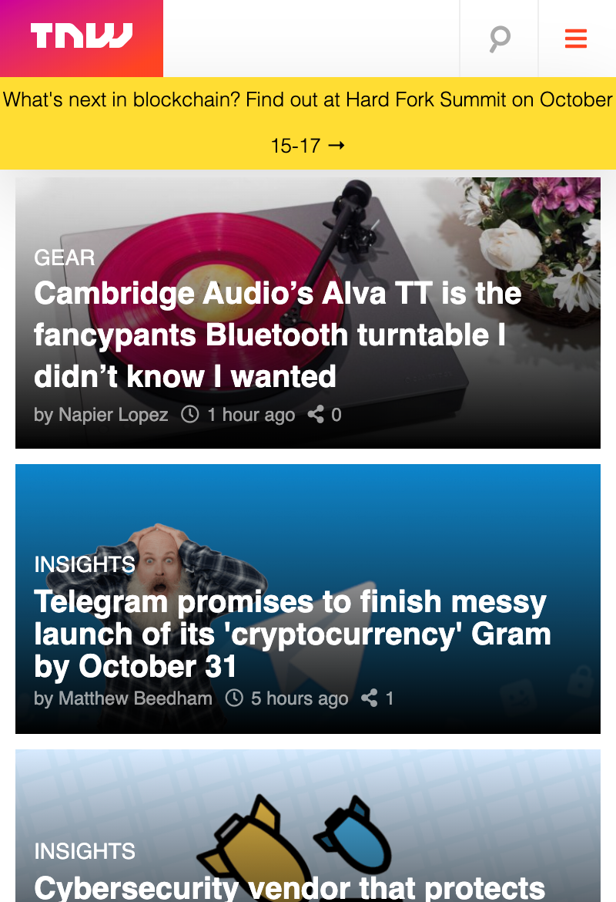

# Building with Responsive Design

This is our solution to Microverse's sixth project. It is a clone of The Next Web home page. The Next Web site is found [here](https://thenextweb.com/). It is created using HTML5 and CSS3.

A live version can be found [here](https://rawcdn.githack.com/davidauza-engineer/Building-with-Responsive-Design/115c67d4263653ce454bd2b5e5b41d81f34f0bd4/index.html).

## Project contributors:

- [David Auza](https://github.com/davidauza-engineer)

- [Eduardo Reis](https://github.com/eduardoreisalvarenga)

## Screenshots

### Screenshot 1

### Screenshot 2

### Screenshot 3

